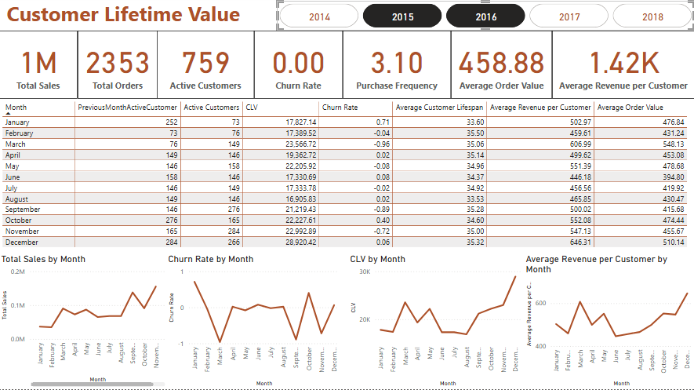

# 📊 Power BI Dashboard: Customer Lifetime Value

## 📌 Project Overview
Calculating customer lifetime value and visualising data in Power BI

## 🔍 Key Analytical Questions / Report Goals
- Which products have the highest sales?
- Which months generate the most revenue?
- Customer lifetime value and churn rate.

## 📈 Dashboard Screenshots

## 🛠️ Tools & Technologies Used
- Power BI Desktop
- DAX
- Power Query
- Excel/CSV (for data preparation)

## 📎 Data Source
https://www.kaggle.com/datasets/vivek468/superstore-dataset-final

## 📚 References / Inspirations
https://olubukunolaakinsola.medium.com/how-to-use-power-bi-to-calculate-customer-lifetime-value-b76a878ddce
